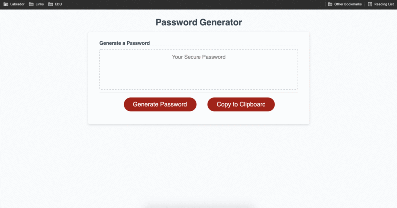

# 03-JavaScript-Password-Generator

This project was to create a random password generator that included numbers, lowercase/uppercase letters, and special characters using javascript. The user is prompted by several alerts that allows them to choose what characters are used in the random password. To increase the experience a copy to clipboard button was included so that the user has a quick way to get the password from the generator to their desired input field for use. 

## GitHub Links 
Live Page [Link](https://jeffcela.github.io/03-JavaScript-Password-Generator/)  
Project Repository [Link](https://github.com/jeffcela/03-JavaScript-Password-Generator)

## How its made!
Make sure to clone or download the entire repository as this document uses **HTML, CSS, GIFs and JavaScript files** Adding additional comments with the HTML or CSS code will allow for the continue ease of use when updating for future use. 

**What is included:**
* index.html
* gitignore (Used to prevent items from being added to the repo)
* assets folder
   * css folder
      * reset.css    
      * style.css
   * js folder
      * script.js 
* images folder
      * PssWd_Gen.gif (Used in README.md file only) 
* README.md

*Please make sure that you are adding any additional assets as needed*

## If you see this you are on the landing page!
   

# Credit 
_This homework assignment was completed in VS Code and Terminal by [Jeff Cela](https://www.linkedin.com/in/jeffcela/) on the day of 07/16/2021_ 
© 2021 Trilogy Education Services, LLC, a 2U, Inc. brand. Confidential and Proprietary. All Rights Reserved. 
_HTML._ W3Schools Online Web Tutorials. (1999). [https://www.w3schools.com/](https://www.w3schools.com/). 
_Learning Javascript is rough, use the best website to learn JavaScript, JavaScript.com!_ JavaScript.com. (n.d.). https://www.javascript.com/resources.  
Animated GIF Maker - Make GIFs from Images or Videos. (2012). https://gifmaker.me/. 
